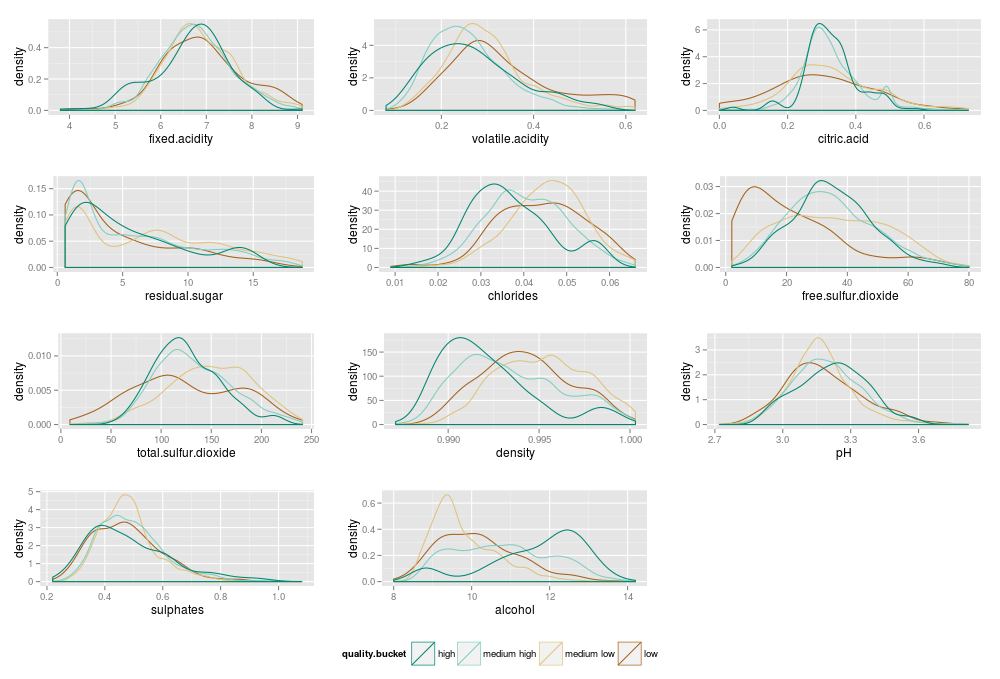
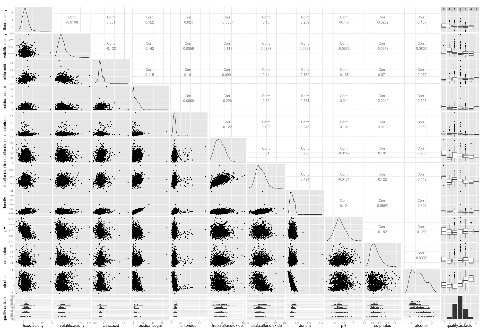

White Wines Quality Study by Sara Carvalho
========================================================


# Introduction

The present document is the final project of the *Data Analysis With R* course from *Udacity*. The project consisted in conducting a exploratory analysis on a dataset of choice.  
The dataset used in this project details the properties of white wines and its quality, according to experts' vote. The details are described in:  

*P. Cortez, A. Cerdeira, F. Almeida, T. Matos and J. Reis.*  
*Modeling wine preferences by data mining from physicochemical properties.*  
*In Decision Support Systems, Elsevier, 47(4):547-553. ISSN: 0167-9236*  

Available at: 

  - [Elsevier](http://dx.doi.org/10.1016/j.dss.2009.05.016)
  - [Pre-press (pdf)](http://www3.dsi.uminho.pt/pcortez/winequality09.pdf)
  - [bib](http://www3.dsi.uminho.pt/pcortez/dss09.bib)

# Analysis

```{r echo=FALSE, message=FALSE, warning=FALSE, packages}
library(ggplot2)
library(dplyr)
library(GGally)
library(gridExtra)
```

```{r echo=FALSE,warning=FALSE, Load_the_Data}
wine <- read.csv('wineQualityWhites.csv', check.names = FALSE)

str(wine)

# Categorical vars
wine$quality.as.factor <- as.ordered(wine$quality)
wine$alcohol.bucket <- cut(round(wine$alcohol), breaks=c(8,10,11,13,15), right = FALSE)
wine$quality.bucket <- cut(round(wine$quality), breaks=c(3,5,6,8,10), right = FALSE, labels = c("low", "medium low", "medium high", "high"))

# Total Acids = fixed + volatile + citric
wine$total.acids <- wine$fixed.acidity + wine$volatile.acidity + wine$citric.acid
```

## Univariate Plots Section
In this section we take a look at each of the variables and their basic statistics, through a series of histograms and summary stats.

### Fixed Acidity
```{r echo=FALSE,warning=FALSE}
summary(wine$fixed.acidity)

ggplot(aes(x = fixed.acidity), data = wine) + 
  geom_histogram(binwidth = .2, color = 'black', fill = 'olivedrab3') +
  geom_vline(xintercept = c(quantile(wine$fixed.acidity, probs = c(0.25,0.5, 0.75))), color = "blue", linetype = 6) +
  geom_vline(xintercept = mean(wine$fixed.acidity), color = "red", linetype = 5)
```

### Volatile Acidity
```{r echo=FALSE,warning=FALSE}
summary(wine$volatile.acidity)

ggplot(aes(x = volatile.acidity), data = wine) + 
  geom_histogram(binwidth = .02, color = 'black', fill = 'olivedrab2') +
  geom_vline(xintercept = c(quantile(wine$volatile.acidity, probs = c(0.25,0.5, 0.75))), color = "blue", linetype = 6) +
  geom_vline(xintercept = mean(wine$volatile.acidity), color = "red", linetype = 5)
```

### Citric Acid
```{r echo=FALSE,warning=FALSE}
summary(wine$citric.acid)

ggplot(aes(x = citric.acid), data = wine) + 
  geom_histogram(binwidth = .03, color = 'black', fill = 'yellow3') +
  geom_vline(xintercept = c(quantile(wine$citric.acid, probs = c(0.25,0.5, 0.75))), color = "blue", linetype = 6) +
  geom_vline(xintercept = mean(wine$citric.acid), color = "red", linetype = 5)

```

### Residual Sugar
```{r echo=FALSE,warning=FALSE}
summary(wine$residual.sugar)

ggplot(aes(x = residual.sugar), data = wine) + 
  geom_histogram(binwidth = .8, color = 'black', fill = 'azure') +
  geom_vline(xintercept = c(quantile(wine$residual.sugar, probs = c(0.25,0.5, 0.75))), color = "blue", linetype = 6) +
  geom_vline(xintercept = mean(wine$residual.sugar), color = "red", linetype = 5)

```
  
### Chlorides
```{r echo=FALSE,warning=FALSE}
summary(wine$chlorides)

ggplot(aes(x = chlorides), data = wine) + 
  geom_histogram(binwidth = .005, color = 'black', fill = 'lightsteelblue') +
  geom_vline(xintercept = c(quantile(wine$chlorides, probs = c(0.25,0.5, 0.75))), color = "blue", linetype = 6) +
  geom_vline(xintercept = mean(wine$chlorides), color = "red", linetype = 5)
```

### Free Sulfur Dioxide
```{r echo=FALSE,warning=FALSE}
summary(wine$free.sulfur.dioxide)

ggplot(aes(x = free.sulfur.dioxide), data = wine) + 
  geom_histogram(binwidth = 5, color = 'black', fill = 'cadetblue') +
  geom_vline(xintercept = c(quantile(wine$free.sulfur.dioxide, probs = c(0.25,0.5, 0.75))), color = "blue", linetype = 6) +
  geom_vline(xintercept = mean(wine$free.sulfur.dioxide), color = "red", linetype = 5)

```

### Total Sulfur Dioxide
```{r echo=FALSE,warning=FALSE}
summary(wine$total.sulfur.dioxide)

ggplot(aes(x = total.sulfur.dioxide), data = wine) + 
  geom_histogram(binwidth = 8, color = 'black', fill = 'cadetblue3') +
  geom_vline(xintercept = c(quantile(wine$total.sulfur.dioxide, probs = c(0.25,0.5, 0.75))), color = "blue", linetype = 6) +
  geom_vline(xintercept = mean(wine$total.sulfur.dioxide), color = "red", linetype = 5)

```

### Density
```{r echo=FALSE,warning=FALSE}
summary(wine$density)

ggplot(aes(x = density), data = wine) + 
  geom_histogram(binwidth = 0.001, color = 'black', fill = 'orangered') +
  geom_vline(xintercept = c(quantile(wine$density, probs = c(0.25,0.5, 0.75))), color = "blue", linetype = 6) +
  geom_vline(xintercept = mean(wine$density), color = "red", linetype = 5)

```

### pH
```{r echo=FALSE,warning=FALSE}
summary(wine$pH)

ggplot(aes(x = pH), data = wine,
  main = "pH") + 
  geom_histogram(binwidth = 0.02, color = 'black', fill = 'firebrick') +
  geom_vline(xintercept = c(quantile(wine$pH, probs = c(0.25,0.5, 0.75))), color = "blue", linetype = 6) +
  geom_vline(xintercept = mean(wine$pH), color = "red", linetype = 5)

```

### Sulphates
```{r echo=FALSE,warning=FALSE}
summary(wine$sulphates)

ggplot(aes(x = sulphates), data = wine,
  main = "Sulphates") + 
  geom_histogram(binwidth = 0.02, color = 'black', fill = 'khaki') +
  geom_vline(xintercept = c(quantile(wine$sulphates, probs = c(0.25,0.5, 0.75))), color = "blue", linetype = 6) +
  geom_vline(xintercept = mean(wine$sulphates), color = "red", linetype = 5)

```


### Alcohol
```{r echo=FALSE,warning=FALSE}
summary(wine$alcohol)

ggplot(aes(x = alcohol), data = wine,
  main = "Alcohol") + 
  geom_histogram(binwidth = 0.2, color = 'black', fill = 'aquamarine3')  +
  geom_vline(xintercept = c(quantile(wine$alcohol, probs = c(0.25,0.5, 0.75))), color = "blue", linetype = 6) +
  geom_vline(xintercept = mean(wine$alcohol), color = "red", linetype = 5)

table(round(wine$alcohol))
table(wine$alcohol.bucket)

```

### Quality
```{r echo=FALSE,warning=FALSE}
summary(wine$quality)

ggplot(aes(x = quality), data = wine,
  main = "Quality") + 
  geom_histogram(binwidth = 1, color = 'black', fill = 'gold') +
  geom_vline(xintercept = c(quantile(wine$quality, probs = c(0.25,0.5, 0.75))), color = "blue", linetype = 6) +
  geom_vline(xintercept = mean(wine$quality), color = "red", linetype = 5)

table(wine$quality.as.factor)
table(wine$quality.bucket)

```

## Univariate Analysis

### What is the structure of your dataset?
The dataset consists of 4898 observations of 12 variables.  
The first 11 variables are numeric measurements of objective tests to the wine. The 12th variable is an integer from 0 to 10
and based on sensory data (median of at least 3 evaluations made by wine experts).

### What is/are the main feature(s) of interest in your dataset?
The main feature of interest is the quality. From the several variables that represent the wine's properties some will have more influence than others in its quality evaluation. From their definition and the subject itself, these are the features I think will have more influence in the quality:

 - Alcohol, a key factor when evaluating wines and other alcoholic beverages;   
 - Acidity, present in 3 different variables in this study: the tartaric acid (fixed acidity), the acetic acid (volatile acidity) and the citric acid. All influence the taste of the wine in a positive and negative way, depending  on the amount and combination.  
 - Sulfur dioxide: measured in the free sulfur dioxide and total sulfur dioxide variables, which, according to the description, can influence the taste of the wine.

### What other features in the dataset do you think will help support your investigation into your feature(s) of interest?
Several relationships are expected to be related with the features of interest:

 - Alcohol, Density and Residual Sugar: alcohol and residual sugar are directly linked to the fermentation process and, for this reason are expected to present a negative strong relationship. The amount of each, in the end of the process, also influences the density of the wine.
 
 - Acidity and pH: since the pH is a scale of how acidic or basic a substance is.
 
 - Free and Total Sulfur Acid: the first is a subset of the latter.

### Did you create any new variables from existing variables in the dataset?
Four new variables were created:

 - *quality.as.factor*: same as quality, but as a categorical ordered variable.
 - *quality.bucket*: categorical variable with 4 different values for quality: low(3,4), medium low (5), medium high(6,7) and high (8,9).
 - *alcohol.bucket*: categorical variable with 4 different intervals for alcohol: [8,9], [10], [11,12] and [13,14].
 - *total.acids*: a sum of the 3 different acidity variables: *fixed.acidity*, *volatile.acidity* and *citric.acid*.

The structure in the end was:
```{r echo=FALSE,warning=FALSE}
str(wine)
```

### Of the features you investigated, were there any unusual distributions? Did you perform any operations on the data to tidy, adjust, or change the form of the data? If so, why did you do this?

No data wrangling was needed to work with the dataset, that also doesn't present any missing values(*NA*).  
Looking at the distribution and basic statistics of the variables one can observe that, in general, the distributions are mostly right skewed and present some outliers (mostly to the right, as well). With further detail, one can also observe:

 - *pH* is the closest to a normal distribution, i.e., the least skewed distribution.
 - *residual.sugar* variable presents a long and heavy tail, as the values for mean and median are not close to the higher peaks.
 - *alcohol* presents a heavy tail, though not as long as *residual.sugar*, with median and mean further from peaks than other distributions.
 - *chlorides* presents a long but not so heavy tail.
 
For the next sections of bivariate and multivariate analysis plots, the top 1% will be omitted for all the variables except *pH*, *sulphates*, *alcohol* and *quality*. For *chlorides* and *residual.sugar*, as the tail is longer, the top 5% will be excluded. This will eliminate the outliers from these distributions and allow a clearer analysis of the rest.

## Bivariate Plots Section

In this section, we will start by looking into the relationship between quality and the other properties of the wine (Quality vs. all).  
Next, we will take a closer look at some of the features identified in the previous section and their relationship with each other. 

### Quality vs. All

#### Box Plots
We will start with a series of box plots of the several variables versus quality (the categorical variable, *quality.as.factor*).

```{r echo=FALSE,fig.width=10, fig.height=10}
grid.arrange(
  ggplot(aes(x = quality.as.factor, y = fixed.acidity), 
       data = subset(wine, fixed.acidity < quantile(wine$fixed.acidity, probs = 0.99))) +
    geom_boxplot(),

  ggplot(aes(x = quality.as.factor, y = volatile.acidity), 
       data = subset(wine, volatile.acidity < quantile(wine$volatile.acidity, probs = 0.99))) +
    geom_boxplot(),

  ggplot(aes(x = quality.as.factor, y = citric.acid), 
       data = subset(wine, citric.acid < quantile(wine$citric.acid, probs = 0.99))) +
    geom_boxplot(),

  ggplot(aes(x = quality.as.factor, y = residual.sugar), 
       data = subset(wine, residual.sugar < quantile(wine$residual.sugar, probs = 0.95))) +
    geom_boxplot(),

  ggplot(aes(x = quality.as.factor, y = chlorides), 
       data = subset(wine, chlorides < quantile(wine$chlorides, probs = 0.95))) +
    geom_boxplot(),

  ggplot(aes(x = quality.as.factor, y = free.sulfur.dioxide), 
       data = subset(wine, free.sulfur.dioxide < quantile(wine$free.sulfur.dioxide, probs = 0.99))) +
    geom_boxplot(),

  ggplot(aes(x = quality.as.factor, y = total.sulfur.dioxide), 
       data = subset(wine, total.sulfur.dioxide < quantile(wine$total.sulfur.dioxide, probs = 0.99))) +
    geom_boxplot(),

  ggplot(aes(x = quality.as.factor, y = density), 
       data = subset(wine, density < quantile(wine$density, probs = 0.99))) +
    geom_boxplot(),

  ggplot(aes(x = quality.as.factor, y = pH), 
       data = wine) +
    geom_boxplot(),

  ggplot(aes(x = quality.as.factor, y = sulphates), 
       data = wine) +
    geom_boxplot(),

  ggplot(aes(x = quality.as.factor, y = alcohol), 
       data = wine) +
    geom_boxplot()
)

```

#### Density Plots
In the next image, we have a collection of density plots of the different wine properties versus the wine categories ( variable *quality.bucket*).


 
### All vs. All
Next, we present the *ggpairs* plot with the relationships between all the initial variables and the quality categorical variable.

```{r echo=FALSE,warning=FALSE, Bivariate_Plots}
#set.seed(1836)
#ggpairs(wine[sample.int(nrow(wine),1000),c(2:12,14)])

```


 
The ggpairs plot is helpful to have a general idea of the different relationships between the several variables. In the next sections, some of these relationships will be looked into with more detail.

### Alcohol, Residual Sugar and Density
First, we take a look at 3 closely tied features through a series scatter plots followed by the Pearson's correlation estimate.
```{r echo=FALSE,warning=FALSE}
# Alcohol vs. Density
ggplot(aes(x = density, y = alcohol), 
       data = subset(wine, density < quantile(wine$density, probs = 0.99))) +
  geom_point(position = position_jitter(), alpha = 1/2, colour = 'aquamarine4') +
  geom_smooth()

# Density vs. Residual Sugar
ggplot(aes(x = density, y = residual.sugar), 
       data = subset(wine, density < quantile(wine$density, probs = 0.99))) + 
  geom_point(position=position_jitter(), color = 'aquamarine3') +
  geom_smooth()

# Alcohol vs. Residual Sugar
ggplot(aes(x = residual.sugar, y = alcohol), 
       data = subset(wine, density < quantile(wine$density, probs = 0.99) &
                       residual.sugar < quantile(wine$residual.sugar, probs = 0.95))) +
  geom_point(alpha = 1/2, color = 'aquamarine2') +
  geom_smooth()

with(subset(wine, density < quantile(wine$density, probs = 0.99)), cor.test(alcohol, density))
with(subset(wine, density < quantile(wine$density, probs = 0.99) & residual.sugar < quantile(wine$residual.sugar, probs = 0.95)), cor.test(residual.sugar, density))
with(subset(wine,residual.sugar < quantile(wine$residual.sugar, probs = 0.95)), cor.test(residual.sugar, alcohol))
```

### Quality and Alcohol
The alcohol density plot, colored by quality:
```{r echo=FALSE,warning=FALSE}
ggplot(aes(x = alcohol), data = wine) +
  geom_density(aes(color = quality.bucket)) +
  scale_color_brewer(palette = "BrBG", guide = guide_legend(reverse = TRUE))

with(wine, cor.test(alcohol, quality))
```

### Quality and Acidity
No strong relationship between quality and any of the acids. Lets look at all the acids together.
```{r echo=FALSE,warning=FALSE}
summary(wine$total.acids)

ggplot(aes(x = quality.as.factor, y = total.acids),
       data = subset(wine, total.acids < quantile(wine$total.acids, probs = 0.99))) + 
  geom_boxplot( fill = 'olivedrab2')

```

### Total Sulfur Dioxide vs. Alcohol
```{r echo=FALSE,warning=FALSE}
ggplot(aes(x = alcohol, y = total.sulfur.dioxide), 
       data = subset(wine,total.sulfur.dioxide  < quantile(wine$total.sulfur.dioxide, probs = 0.99))) +
  geom_point(color = 'cadetblue4') +
  geom_smooth()

with(subset(wine, total.sulfur.dioxide < quantile(wine$total.sulfur.dioxide, probs = 0.99)), cor.test(total.sulfur.dioxide, alcohol))
```

### Free Sulfur Dioxide, Total Sulfur Dioxide And Quality
Density plots and correlation estimates for the relationship between the sulfur dioxide features and quality:

```{r echo=FALSE,warning=FALSE}
ggplot(aes(x = total.sulfur.dioxide), 
       data = subset(wine, total.sulfur.dioxide < quantile(wine$total.sulfur.dioxide, probs = 0.99))) +
  geom_density(aes(color = quality.bucket)) +
  scale_color_brewer(palette = "BrBG", guide = guide_legend(reverse = TRUE))

with(subset(wine, total.sulfur.dioxide < quantile(wine$total.sulfur.dioxide, probs = 0.99)), cor.test(total.sulfur.dioxide, quality))

ggplot(aes(x = free.sulfur.dioxide), 
       data = subset(wine, free.sulfur.dioxide < quantile(wine$free.sulfur.dioxide, probs = 0.99))) +
  geom_density(aes(color = quality.bucket)) +
  scale_color_brewer(palette = "BrBG", guide = guide_legend(reverse = TRUE))

with(subset(wine, free.sulfur.dioxide < quantile(wine$free.sulfur.dioxide, probs = 0.99)), cor.test(free.sulfur.dioxide, quality))
```

### Chlorides vs. Alcohol
```{r echo=FALSE,warning=FALSE}
ggplot(aes(x = alcohol.bucket, y = chlorides), 
       data = subset(wine, chlorides < quantile(wine$chlorides, probs = 0.95))) + 
  geom_boxplot()

ggplot(aes(x = alcohol, y = chlorides),
       data = subset(wine, chlorides < quantile(wine$chlorides, probs = 0.95))) +
  geom_point() + 
  geom_smooth()

ggplot(aes(x = chlorides), 
       data = subset(wine, chlorides < quantile(wine$chlorides, probs = 0.95))) + 
  geom_density(aes(color = alcohol.bucket)) +
  scale_color_brewer(palette = "RdYlGn", guide = guide_legend(reverse = TRUE))

with(subset(wine, chlorides < quantile(wine$chlorides, probs = 0.95)), cor.test(chlorides, alcohol))

```

### Chlorides vs. Quality
```{r echo=FALSE,warning=FALSE}
ggplot(aes(x = quality.bucket, y = chlorides), 
       data = subset(wine, chlorides < quantile(wine$chlorides, probs = 0.95))) + 
  geom_boxplot()

ggplot(aes(x = chlorides), 
       data = subset(wine, chlorides < quantile(wine$chlorides, probs = 0.95))) + 
  geom_density(aes(color = quality.bucket)) +
  scale_color_brewer(palette = "BrBG", guide = guide_legend(reverse = TRUE))

with(subset(wine, chlorides < quantile(wine$chlorides, probs = 0.95)), cor.test(chlorides, quality))
```

## Bivariate Analysis

### Talk about some of the relationships you observed in this part of the investigation. How did the feature(s) of interest vary with other features in the dataset?
In terms of the properties relationship with the quality feature, I was able to observe:

 - Alcohol is the most strongly related feature.
 - Density and Residual Sugar, both linked with alcohol, also show a strong relationship.
 - Chlorides present a weak, yet relevant, relationship.
 - None of the acids, or the combination of them, has a significant connection with quality.
 - Free Sulfur Dioxide, seems to have no strong link with quality, except for the low quality wines.

### Did you observe any interesting relationships between the other features (not the main feature(s) of interest)?
Alcohol, Density and Residual Sugar are linked by definition, and the relationships between each of them are the strongest ones observed.  
Chlorides, Alcohol are significantly correlated.  
Total Sulfur Dioxide and Alcohol present a relevant relationship, as well.  

### What was the strongest relationship you found?
The strongest relationships found are density vs. alcohol and density vs. residual sugar.

## Multivariate Plots Section
In this section we revisit some of the previous plots, adding some new information. These plots will mainly explore the several relationships' influence to the wine quality.

### Alcohol vs. Residual.Sugar and Quality
```{r echo=FALSE,warning=FALSE}
ggplot(aes(x = residual.sugar, y = alcohol), 
       data = subset(wine, density < quantile(wine$density, probs = 0.99) &
         residual.sugar < quantile(wine$residual.sugar, probs = 0.95))) + 
  geom_point(aes(color = quality.bucket)) +
  scale_color_brewer(palette = "BrBG", guide = guide_legend(reverse=TRUE))
```

### Alcohol vs. Residual Sugar and Density
```{r echo=FALSE,warning=FALSE}
ggplot(aes(x = residual.sugar, y = alcohol), 
       data = subset(wine, density < quantile(wine$density, probs = 0.99) &
         residual.sugar < quantile(wine$residual.sugar, probs = 0.95))) + 
  geom_point(aes(color = density)) +
  scale_color_continuous(low = "khaki2", high = "firebrick", guide = guide_legend(reverse=TRUE))
```

### Residual Sugar vs. Density and Alcohol 
```{r echo=FALSE,warning=FALSE}
ggplot(aes(x = density, y = residual.sugar), 
       data = subset(wine, density < quantile(wine$density, probs = 0.99) &
         residual.sugar < quantile(wine$residual.sugar, probs = 0.95))) + 
  geom_point(position=position_jitter(), aes(color = alcohol.bucket)) +
  scale_color_brewer(palette = "RdYlGn", guide = guide_legend(reverse = TRUE))
```

### Total Sulfur Dioxide vs. Chlorides and Alcohol
```{r echo=FALSE,warning=FALSE}
ggplot(aes(x = chlorides, y = total.sulfur.dioxide),
       data = subset(wine, total.sulfur.dioxide < quantile(wine$total.sulfur.dioxide, probs = 0.99) &
                       chlorides < quantile(wine$chlorides, probs = 0.95))) +
  geom_point(aes(color = alcohol.bucket)) +
  scale_color_brewer(palette = "RdYlGn", guide = guide_legend(reverse = TRUE))
```

### Chlorides vs. Alcohol and Quality
```{r echo=FALSE,warning=FALSE}
ggplot(aes(x = alcohol, y = chlorides),
       data = subset(wine, chlorides < quantile(wine$chlorides, probs = 0.95))) +
  geom_point(aes(color = quality.bucket)) +
  scale_color_brewer(palette = "BrBG", guide = guide_legend(reverse = TRUE))
```

### Total Sulfur Dioxide vs. Alcohol and Quality
```{r echo=FALSE,warning=FALSE}
ggplot(aes(x = alcohol, y = total.sulfur.dioxide),
       data = subset(wine, total.sulfur.dioxide < quantile(wine$total.sulfur.dioxide, probs = 0.99))) +
  geom_point(aes(color = quality.bucket)) +
  scale_color_brewer(palette = "BrBG", guide = guide_legend(reverse = TRUE))
```

### Alcohol vs. Free Sulfur Dioxide and Quality
```{r echo=FALSE,warning=FALSE}
ggplot(aes(x = free.sulfur.dioxide, y = alcohol),
       data = subset(wine, free.sulfur.dioxide < quantile(wine$free.sulfur.dioxide, probs = 0.99))) +
  geom_point(aes(color = quality.bucket)) +
  scale_color_brewer(palette = "BrBG", guide = guide_legend(reverse = TRUE)) 
```

### pH vs. Citric Acid and Quality

```{r echo=FALSE,warning=FALSE}
ggplot(aes(x = pH, y = citric.acid), 
       data = subset(wine, citric.acid < quantile(wine$citric.acid, probs = 0.99))) +
  geom_density2d(aes(color = quality.bucket)) +
  scale_color_brewer(palette = "BrBG") + 
  facet_wrap(~quality.bucket)
```

## Multivariate Analysis

### Talk about some of the relationships you observed in this part of the investigation. Were there features that strengthened each other in terms of looking at your feature(s) of interest?
Once again, the plots show the strong relationship between quality and alcohol. The same is true for residual sugar and density, which also strongly relate to each other and with alcohol.
Plotting chlorides vs. total sulfur dioxide one can observe a noticeable relationship with alcohol. The alcohol value increases as the values for these variables decrease.  
However, plotting the chlorides vs. alcohol and coloring by quality, one can also see that the alcohol feature is a much stronger factor in the distribution of quality. The same is true with total sulfur dioxide vs. alcohol.  
Furthermore, one can observe that small values of free sulfur dioxide are linked with low quality wine, although the relationship isn't as strong with the rest of the quality steps.  
Looking at the relationship between citric acid (which is responsible for the fresh, fruity flavor) and pH, and dividing by quality, one can observe that the high quality wines are linked to values of citric acid in the middle of the distribution, and not at all with high or low values for this feature.  

### Were there any interesting or surprising interactions between features?
No relevant relationships between any of the acids and quality, as well as pH, was a surprise.
Also, all the relevant relationships with quality become so through their relevant relationship with alcohol.
 
------

## Final Plots and Summary

### Plot One
```{r echo=FALSE, warning=FALSE, Plot_One}
ggplot(aes(x = quality.as.factor, y = alcohol), data = wine) +
  geom_boxplot(aes(fill = quality.bucket), varwidth = TRUE) +
  scale_fill_brewer(palette = "BrBG", guide = guide_legend(reverse=TRUE))
```

### Description One
Plot one is a box plot of *alcohol* vs. *quality.as.factor*. The plot is colored according to the *quality.bucket* interval it belongs, and the width is proportional to the number of observations.
In this plot, we can observe a strong relationship between the two variables. This relationship is positive except for the low quality wine.
The alcohol is the strongest feature regarding wine quality.

### Plot Two
```{r echo=FALSE, warning=FALSE, Plot_Two}
# Density, Alcohol, Residual Sugar or Quality
ggplot(aes(x = density, y = alcohol), 
       data = subset(wine, density < quantile(wine$density, probs = 0.99))) + 
  geom_point(aes(color = quality.bucket)) +
  scale_color_brewer(palette = "BrBG", guide = guide_legend(reverse=TRUE)) +
  geom_smooth(color = "firebrick")
```

### Description Two
Plot 2 is a scatter plot of *alcohol* vs. *density*, colored by *quality.bucket*.  This is the strongest relationship between the features of the dataset. As the value of alcohol increases, the density decreases, as expected. Through the coloring one can observe the distribution of quality wines regarding the prior relationship. For example, the high quality wines present high alcohol values and middle density levels.  
In the plot there is also a smoothed conditional mean line of the relationship.

### Plot Three
```{r echo=FALSE, warning=FALSE, Plot_Three}
ggplot(aes(x = total.sulfur.dioxide, y = chlorides), 
       data = subset(wine, total.sulfur.dioxide < quantile(wine$total.sulfur.dioxide, probs = 0.99) &
                       chlorides < quantile(wine$chlorides, probs = 0.95))) + 
  geom_point(aes(color = alcohol.bucket), alpha = 1/2) +
  scale_color_brewer(palette = "RdYlGn", guide = guide_legend(reverse=TRUE)) +
  facet_wrap(~quality.bucket)
```

### Description Three
Plot 3 is a scatter plot of *chlorides* vs. *total.sulfur.dioxide*, colored by *alcohol.bucket* intervals and faceted by *quality.bucket*.  
In this plot one can observe the relationship between two features linked with alcohol, where higher values of chlorides and total.sulfur.acid are mostly associated with lower values for alcohol, while the middle and lower values of these two features are associated with higher alcohol values.  
Faceting by quality, one can observe that the low and medium low squares are mostly populated with wines with lower values for alcohol, and that the wine with higher values for alcohol is mostly in the medium high and high quality levels.

------

# Reflection  

Through this analysis I was able to identify some of the features that may influence the quality of the white wines. The alcohol was the most relevant feature, along with the features directly linked to it through the fermentation process (density and residual.sugar). I also studied some other features that presented a relationship with alcohol, and therefore also presented some correlation with quality.
To conclude, it is also important to note that, although the only strong relationship found was with alcohol, quality is a subjective measure and can be influence by other factors that are not the objective measurements. 
